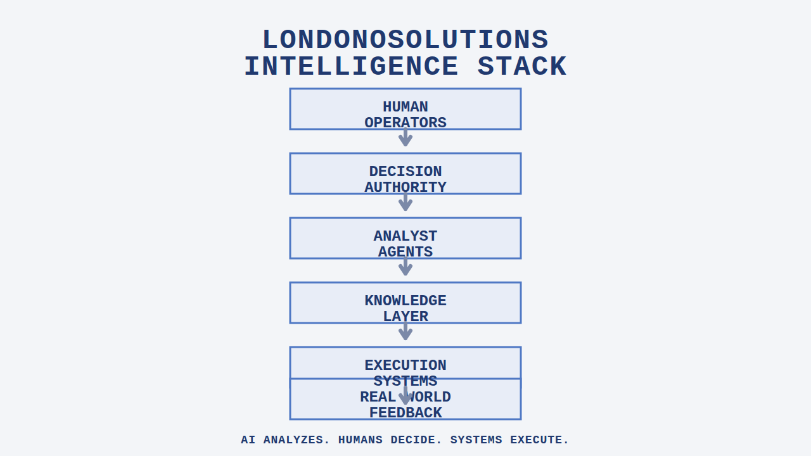

# How LondonoSolutions Runs Intelligence

**Tagline:** Canonical technical documentation for the LondonoSolutions intelligence framework.

> LondonoSolutions is an intelligence stewardship firm that designs and governs AI-powered decision systems for organizations.

**Date:** March 7, 2026  
**Owner:** LondonoSolutions  
**Version:** v1.3

## What This Repository Is

This repository is the canonical technical documentation for the LondonoSolutions intelligence framework.

It explains the operating rule, architecture, control loop, lifecycle, safeguards, and operating system before readers move into the supporting operational documents that implement the framework.

It is organized so readers can move from **doctrine**, to **architecture**, to **operational protocols** without losing the authority model behind the system.

## Intelligence Rule

> **AI analyzes. Humans decide. Systems execute.**

This is the operating rule behind every LondonoSolutions intelligence system. The framework is designed so AI expands analysis, humans retain authority, and governed systems execute only inside approved boundaries.

## Core Principles

- **Human authority** remains above every meaningful decision
- **Model replaceability** prevents dependency on any single model vendor
- **Reversibility** keeps actions governed by rollback and containment
- **Auditability** keeps reasoning, approvals, and outcomes traceable
- **Institutional memory** preserves decision context for future learning

## Intelligence Architecture

LondonoSolutions uses a human-governed intelligence stack that keeps decision authority above AI analysis and system execution below approved decisions.



**AI analyzes. Humans decide. Systems execute.**

1. **Human Operators** define the mission and remain accountable for outcomes
2. **Decision Authority** applies policy and human authorization before action
3. **Analyst Agents** perform structured analysis and scenario evaluation without owning decisions
4. **Knowledge Layer** provides context, memory, and traceability for analysis and execution
5. **Execution Systems** run tools, APIs, and workflows inside governed boundaries
6. **Real World Feedback** returns outcomes to the system so future decisions improve without losing accountability

Link to: [docs/system-overview.md](docs/system-overview.md)

## AI OODA Loop

**Observe → Orient → Decide → Act → Learn**

This is the core control loop for LondonoSolutions intelligence systems. It keeps learning connected to governed action instead of collapsing analysis, decision-making, and execution into one opaque system.

Link to: [docs/ai-ooda-loop.md](docs/ai-ooda-loop.md)

## Agent Lifecycle

Sandbox → Trusted → Hosted

Link to: [agents.md](agents.md)

## System Safeguards

- Kill-switch capability
- Full audit trails
- Human escalation
- Memory ownership
- Decision accountability

Links to: [agents.md](agents.md) and [docs/londono-intelligence-standard.md](docs/londono-intelligence-standard.md)

## Intelligence Operating System

Analyze → Decide → Execute → Learn

The intelligence operating system turns doctrine into execution while preserving authority, traceability, and reversibility.

- [sitrep.md](sitrep.md) — active protocol map, current operating update, and measurable objectives
- [content-distribution.md](content-distribution.md) — distribution workflow and channel governance
- [londono-web-system.md](londono-web-system.md) — website-aligned system architecture and publishing context

## Field Manual

Use these documents to understand the canonical framework in more depth before moving into operating updates and implementation details.

- [docs/system-overview.md](docs/system-overview.md)
- [agents.md](agents.md)
- [offerings.md](offerings.md)
- [docs/ai-ooda-loop.md](docs/ai-ooda-loop.md)
- [docs/londono-intelligence-standard.md](docs/londono-intelligence-standard.md)
- [londono-web-system.md](londono-web-system.md)

## SmartAgents Platform

SmartAgents is the execution environment for LondonoSolutions intelligence systems.

Link to: [smart-agents-app](https://github.com/mattewlondono22/smart-agents-app)

## Repository Structure

```text
.
├── README.md
├── agents.md
├── offerings.md
├── content-distribution.md
├── londono-web-system.md
├── sitrep.md
└── docs/
    ├── ai-ooda-loop.md
    ├── system-overview.md
    ├── londono-intelligence-standard.md
    └── images/
        ├── intelligence-stack.png
        └── intelligence-stack.svg
```

- **Doctrine**: `README.md`, `agents.md`, `offerings.md`, `docs/ai-ooda-loop.md`, `docs/londono-intelligence-standard.md`
- **Architecture**: `docs/system-overview.md`, `docs/images/intelligence-stack.png`, `docs/images/intelligence-stack.svg`
- **Operational protocols**: `sitrep.md`, `content-distribution.md`, `londono-web-system.md`

## Closing

LondonoSolutions builds decision intelligence infrastructure, not just AI tools.

Version: v1.3  
Owner: LondonoSolutions
